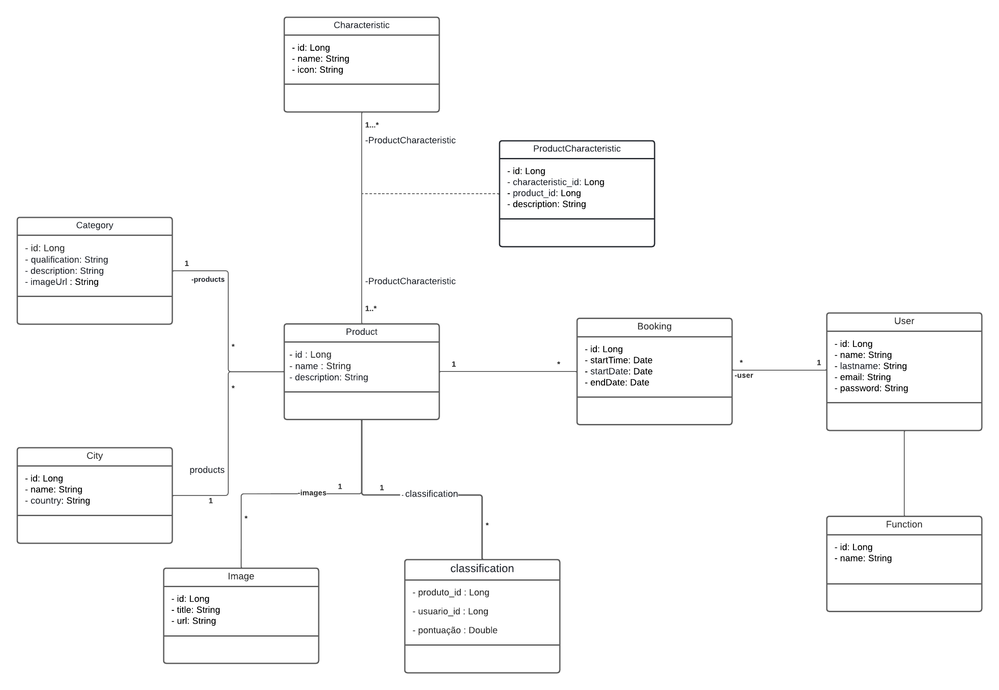
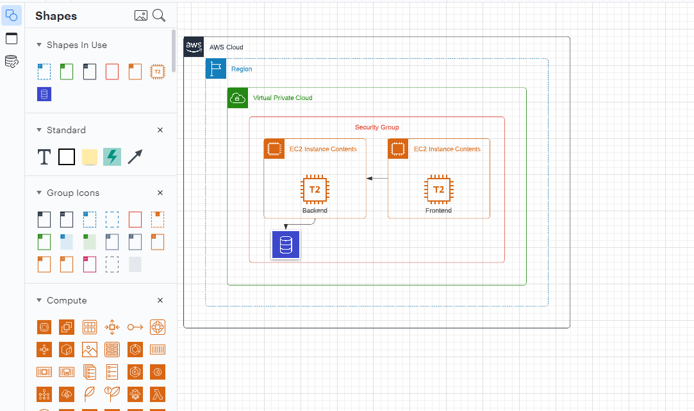
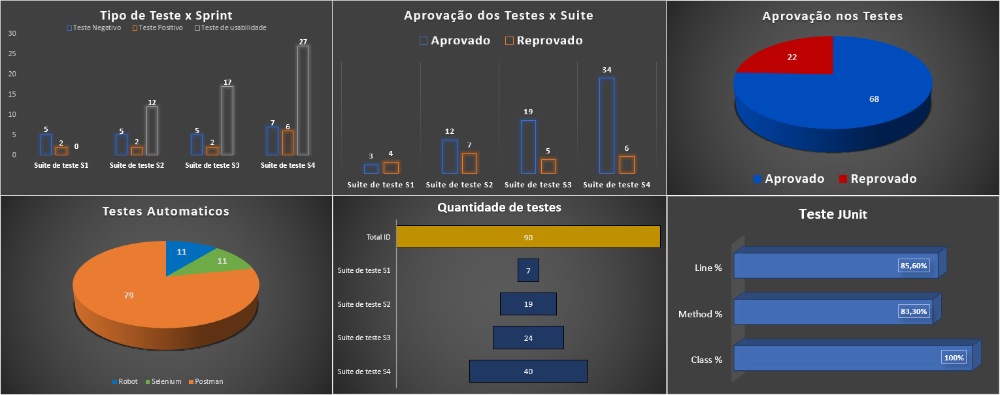

## Projeto

- **Nome do Projeto**: Autolux
- Link do site : http://autolux.ctdprojetos.com.br/

Aluguel de carros exclusivos, veículos sofisticados, potentes e confortáveis, com acessórios e acabamentos à altura da exigência de quem dirige. Além disso, com a experiência única de dirigir um carro com motorização diferenciada e uma performance superior aos demais.

- **Objetivo**: Desenvolver um site para alguel de carros de luxo de forma pratica e rápida, sem muita burocracia e de fácil visualização dos produtos

## Equipe

- **Gabriel Gomes**: Backend, Frontend, Banco de dados, infra;
- **Karina Osuka**: Frontend, UX/UI, infra;
- **Paulo Rossi**: Frontend;
- **Dayana Miranda**: Frontend, infra;
- **Kantuta Molina**: Testing; 

## Metodología de trabalho

- Utilizamos a metodologia Scrum, realizando planing, daily, retro e review durante todo processo para que conseguíssemos nos alinhar e não perder tempo com erros que poderíamos evitar, tivemos algumas dificuldades em certo pontos do projeto, mas sempre que acontecia algo que segurasse nosso grupo por um tempo, nos reuníamos para resolver o problema para o projeto seguir o fluxo normal e entregar tudo dentro do prazo.

- Nós decidimos devidir a equipe em 3 pessoas no front, 1 no back e 1 em testing.
- Como em front-end haviam muitos detalhes e interações de acessibilidade colocamos mais pessoas.
- Em back-end sempre alinhado as requisições necessárias de front-end 
- Os tetes cobrindo a maior quantidade de erros possíveis 

## Registro do projeto

- Na sprint 1:
    - Planejamento e início das tarefas. Conseguimos trabalhar em equipe e realizar as primeiras entregas.
- Na spring 2:
    - As tarefas começaram a ficar um pouco mais exigentes, mas com algumas pesquisas e trabalho em equipe conseguimos entregar tudo.
- Na sprint 3: 
    - O back-end nesse ponto já estava pronto e sendo moldado sempre que o front-end precisasse, haviam muitas tarefas, mas conseguimos entregar tudo no fim da sprint. Realizamos os testes após o desenvolvimento, encontrando erros e consequentemente corrigimos.
- Na sprint 4 :
    - Faltava subir o front e o back na AWS e finalizar o front, tivemos problemas na parte da AWS mas com ajuda conseguimos resolver e subimos tudo.
    - OBS: O backend já estava de pé no heroku desde a primeira sprint, com isso conseguimos que o front já estivesse conectado ao back de testes desde o inicio.
---

* Pontos fortes da equipe:
    - Excelente trabalho em equipe
    - Boa comunicação
    - Automotivação
    - Vontade de aprender
    - Proatividade
    - Criatividade

## Tecnologías utilizadas

  * Front end
    - Reactjs
    - HTML
    - CSS
    - Javascript
    - yarn
    - VSCode
    + Bibliotecas:
      - Bootstrap
      - Axios/Fetch
      - chakra UI
      - Google Maps
      - Phosphor icons
      - Formik
      - Sweet Alert

  * Back end
    - Java
    - Spring Boot
    - Spring Security
    - JWT
    - Arquitetura REST
    - JUnit
    - Intellij

  * Base de datos
    - MySQL
    - Postegres (teste)

  * Infraestructura
    - AWS
    - Heroku (Desenvolvimento)

  * Testing
    - Selenium IDE
    - Robotframework
    - Postman

## Documentação técnica do projeto

* Para inicializar o Front-end
    - yarn install
    - yarn start
- Irá encontrar todos os componentes na pasta de componentes 
- Sempre criar um componente com a primeira letra maiúscula e seguir no modelo camelcase
- Ao implementar uma nova funcionalidade e verificar que está tudo ok e realizar o commit na hora que foi feito antes continuar
- Commits sempre bem descritivos sobre oque aconteceu

* Base de dados
    - Acesso a toda informação do banco de dados nesse link https://pleasant-chatter-564.notion.site/Banco-de-dados-1a5ebd5c035a48329c33114c79840045

* Componentes e diagramas do backend

  
  - Acesso as rotas e descrições da nossa API : https://back-end-booking.herokuapp.com/swagger-ui/index.html#/

* Infraestructura

  

* Testing e qualidade

